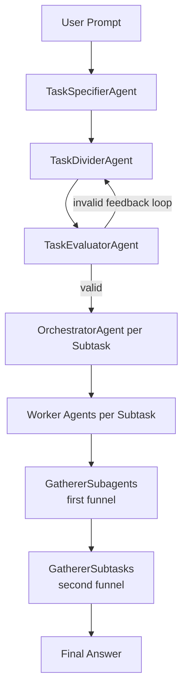

# Elvex v2

## Project Summary
Elvex v2 is a multi-agent orchestration pipeline that turns a user prompt into a final natural-language answer through staged planning, decomposition, execution, and aggregation. The system first specifies the task, divides it into subtasks, validates the split, and then orchestrates specialized worker agents per subtask. Each run persists artifacts under `outputs/runs/<run_id>/` so the workflow remains inspectable and reproducible.

The execution model uses a double-funnel architecture: worker outputs are first consolidated per subtask (`gatherer_subagents`), then those subtask-level outputs are combined into a final user-facing response (`gatherer_subtasks`). This keeps decomposition and execution granular while preserving a coherent final output.


## Design Highlights
- **Model-agnostic**: provider registry supports OpenAI, Anthropic, and Ollama via a unified interface
- **Topological task ordering**: subtask dependencies resolved with Kahn's algorithm
- **Typed contracts**: all agent I/O validated with Pydantic models
- **Self-correcting pipeline**: evaluator feedback loop forces the divider to revise invalid decompositions



## Run With Docker
1. Configure environment variables:
```bash
cp .env.example .env
```
Required keys:
- `PROVIDER_USED` (`openai`, `ollama`, or `claude`)
- `OPENAI_API_KEY` (if using OpenAI)
- `OPENAI_MODEL` (for OpenAI runs)

Optional observability keys (Langfuse):
- `LANGFUSE_PUBLIC_KEY`
- `LANGFUSE_SECRET_KEY`
- `LANGFUSE_BASE_URL` (defaults to `https://cloud.langfuse.com`)

2. Build and start the API:
```bash
docker compose up --build
```

3. Open the API:
- Root: `http://127.0.0.1:8000/`
- Interactive docs: `http://127.0.0.1:8000/docs`
- Health check: `http://127.0.0.1:8000/health`

Workflow artifacts are written to `outputs/runs/<run_id>/`. Docker Compose mounts `./outputs` into the container so generated files remain available on your machine.

To stop the API:
```bash
docker compose down
```

## Run Locally
1. Create and activate a virtual environment with `uv`:
```bash
uv venv
source .venv/bin/activate
```

2. Install dependencies:
```bash
uv pip install -e .
```

3. Configure environment variables (copy example and edit values):
```bash
cp .env.example .env
```
Required keys:
- `PROVIDER_USED` (`openai`, `ollama`, or `claude`)
- `OPENAI_API_KEY` (if using OpenAI)
- `OPENAI_MODEL` (for OpenAI runs)

Optional observability keys (Langfuse):
- `LANGFUSE_PUBLIC_KEY`
- `LANGFUSE_SECRET_KEY`
- `LANGFUSE_BASE_URL` (defaults to `https://cloud.langfuse.com`)

4. Run the workflow from the CLI:
```bash
elvex
```
or
```bash
elvex --prompt "Plan a 7-day trip to Malaysia"
```

5. Run the API without Docker:
```bash
uv run uvicorn elvex.api.app:app --reload
```
Then open the interactive docs at `http://127.0.0.1:8000/docs`.

## Langfuse Tracing
When `LANGFUSE_PUBLIC_KEY` and `LANGFUSE_SECRET_KEY` are configured, the workflow sends traces to Langfuse with:
- root trace for the full workflow
- stage spans (specifier/divider/evaluator/orchestrator/workers/gatherers)
- generation events for each LLM call (input, output, latency, errors)
- tool spans for worker tool calls
- usage/token metadata when the provider returns it
