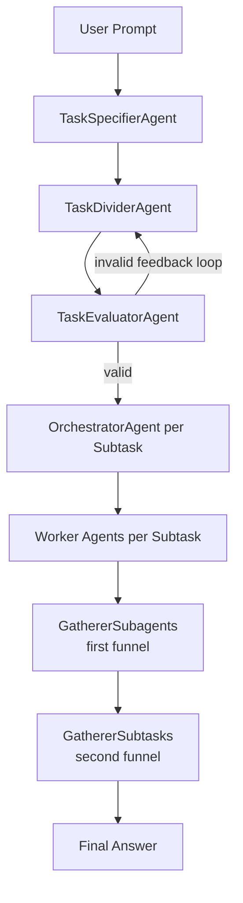

# Elvex v2

## Project Summary
Elvex v2 is a multi-agent orchestration pipeline that turns a user prompt into a final natural-language answer through staged planning, decomposition, execution, and aggregation. The system first specifies the task, divides it into subtasks, validates the split, and then orchestrates specialized worker agents per subtask. Each run persists artifacts under `outputs/runs/<run_id>/` so the workflow remains inspectable and reproducible.

The execution model uses a double-funnel architecture: worker outputs are first consolidated per subtask (`gatherer_subagents`), then those subtask-level outputs are combined into a final user-facing response (`gatherer_subtasks`). This keeps decomposition and execution granular while preserving a coherent final output.


## Design Highlights
- **Model-agnostic**: provider registry supports OpenAI, Anthropic, and Ollama via a unified interface
- **Topological task ordering**: subtask dependencies resolved with Kahn's algorithm
- **Typed contracts**: all agent I/O validated with Pydantic models
- **Self-correcting pipeline**: evaluator feedback loop forces the divider to revise invalid decompositions


```mermaid
flowchart TD
    A[User Prompt] --> B[TaskSpecifierAgent]
    B --> C[TaskDividerAgent]
    C --> D[TaskEvaluatorAgent]
    D -->|valid| E[OrchestratorAgent per Subtask]
    D -->|invalid feedback loop| C
    E --> F[Worker Agents per Subtask]
    F --> G[GathererSubagents<br/>first funnel]
    G --> H[GathererSubtasks<br/>second funnel]
    H --> I[Final Answer]
```

## Quick Start With Docker
1. Configure environment variables:
```bash
cp .env.example .env
```
Required keys:
- `PROVIDER_USED` (`openai`, `ollama`, or `claude`)
- `OPENAI_API_KEY` (if using OpenAI)
- `OPENAI_MODEL` (for OpenAI runs)

Optional observability keys (Langfuse):
- `LANGFUSE_PUBLIC_KEY`
- `LANGFUSE_SECRET_KEY`
- `LANGFUSE_BASE_URL` (defaults to `https://cloud.langfuse.com`)

2. Build and start the API and Elvex Studio:
```bash
docker compose up --build
```

3. Open Elvex:
- Studio: `http://127.0.0.1:5173/`
- Root: `http://127.0.0.1:8000/`
- Interactive docs: `http://127.0.0.1:8000/docs`
- Health check: `http://127.0.0.1:8000/health`

Create a workflow run:
```bash
curl -X POST http://127.0.0.1:8000/runs \
  -H "Content-Type: application/json" \
  -d '{"prompt": "Plan a 7-day trip to Malaysia"}'
```

Workflow artifacts are written to `outputs/runs/<run_id>/`. Docker Compose mounts `./outputs` into the container so generated files remain available on your machine.

### How the frontend talks to FastAPI in Docker

Docker Compose starts two services on the same private Docker network:

- `elvex-api`: FastAPI listens on port `8000`
- `elvex-studio`: Nginx serves the compiled React app on port `5173`

The browser sends Studio requests to `/api`. Nginx proxies them internally to
`http://elvex-api:8000`, so the frontend does not contain an API hostname and
the API key remains only in the backend container. The frontend never receives
provider credentials.

Studio creates a background workflow with `POST /studio/runs` and polls
`GET /studio/runs/{run_id}` while it is running. FastAPI returns the accumulated
workflow events so the interface can update specifiers, dividers, evaluators,
subtasks, orchestrators, workers and gatherers as they finish.

To stop Elvex:
```bash
docker compose down
```

## Run Locally
1. Create and activate a virtual environment with `uv`:
```bash
uv venv
source .venv/bin/activate
```

2. Install dependencies:
```bash
uv pip install -e .
```

3. Configure environment variables (copy example and edit values):
```bash
cp .env.example .env
```
Required keys:
- `PROVIDER_USED` (`openai`, `ollama`, or `claude`)
- `OPENAI_API_KEY` (if using OpenAI)
- `OPENAI_MODEL` (for OpenAI runs)

Optional observability keys (Langfuse):
- `LANGFUSE_PUBLIC_KEY`
- `LANGFUSE_SECRET_KEY`
- `LANGFUSE_BASE_URL` (defaults to `https://cloud.langfuse.com`)

4. Run the workflow from the CLI:
```bash
elvex
```
or
```bash
elvex --prompt "Plan a 7-day trip to Malaysia"
```

5. Run the API without Docker:
```bash
uv run uvicorn elvex.api.app:app --reload
```
Then open the interactive docs at `http://127.0.0.1:8000/docs`.

6. In a second terminal, run Elvex Studio locally:
```bash
cd frontend
npm install
npm run dev
```
Then open `http://127.0.0.1:5173`. In local development, Studio connects
directly to FastAPI at `http://localhost:8000`. To use another backend URL,
copy `frontend/.env.example` to `frontend/.env` and change `VITE_API_URL`.

## Elvex Studio

Elvex Studio is a lightweight visual interface for the workflow:

- OpenAI is selected by default, with Claude and Ollama available
- live status for planning, evaluation and aggregation stages
- generated subtasks and their dependency order
- a visual character for every specialist worker
- click-through inspection of objectives, prompts and outputs
- final answer and failure feedback in the same run view

The existing synchronous `POST /runs` endpoint remains available. Studio uses
the separate `/studio/runs` endpoints so existing API integrations keep the
same behavior.

OpenAI and Claude work with the corresponding keys in `.env`. The current
Ollama client expects the `ollama` executable on the same machine as FastAPI,
so use Ollama with the local development setup rather than the Docker API
container.

## Langfuse Tracing
When `LANGFUSE_PUBLIC_KEY` and `LANGFUSE_SECRET_KEY` are configured, the workflow sends traces to Langfuse with:
- root trace for the full workflow
- stage spans (specifier/divider/evaluator/orchestrator/workers/gatherers)
- generation events for each LLM call (input, output, latency, errors)
- tool spans for worker tool calls
- usage/token metadata when the provider returns it
